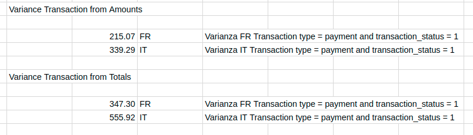

# Assignment 2. Statistical test 


Task: 

* José María is not very familiar with statistics however he knows the concept of statistical
significance. He writes to you another e-mail:
> "Hi, Thanks for the numbers. Just one doubt: is the difference
between France and Italy meaningful? Let me know. Best. JM."


You should answer the question by writing a brief summary.
Hint: “Meaningful” can be interpreted as “statistically significant”.


## Steps

1. First lets remember when is a difference "stastitically significant".

>En estadística, un resultado es estadísticamente significativo, cuando es improbable que haya sido al azar.
Una diferencia estadísticamente significativa, solamente significa que hay evidencias estadísticas de que hay una diferencia.
No significa que la diferencia sea grande, importante, o radicalmente diferente.

Prueba de hipótesis para la media
https://www.youtube.com/watch?v=AJcy4eZMwWM

Teoría + 1 ejemplo.
https://www.youtube.com/watch?v=tCLeJCuBSZM

2. Is the difference between France Average Ticket difference with Italy "statistically significant"?


Sum of transaction_amount-s where;
  - transaction_type = payment
  - transaction_status = 1
    
    
| Country      | Revenue Amount | Revenue Total | Ticket Amount | Ticket Total | Population |
|-------------:|-------------:|-------------:|-------------:|-------------:|-------------:|
| FR    |  66,891.49 € | 84020.53 € | 22.62 €  | 28.41 € |2957 |  
| IT    |  77,377.19 € | 96588.68 € | 21.56 €  | 26.91 €  | 3589 |


3. Calculate Variances:
```
=IF(AND(H2 = 1, I2="payment"),"1","")
=VAR(FILTER(M2:M100, P2:P100 = "1", K2:K100 = "FR")) 
```



```
select count(transaction_id)
from payment_transactions
where transaction_country = 'FR'
and DATE_PART(y, transaction_timestamp) = 2017
and transaction_type = 'payment'
and transaction_status = 1; 

select count(transaction_id)
from payment_transactions
where transaction_country = 'IT'
and DATE_PART(y, transaction_timestamp) = 2017
and transaction_type = 'payment'
and transaction_status = 1; 
```

