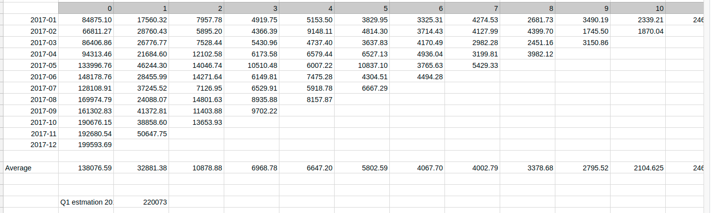

# Cohort analysis


Task:
*  Calculate how much money the company will make next year


### Steps

1. Lets build cohort analysis "acordeon"

For each month I have extracted how much users are spending each month
```
select date_trunc('month', transaction_timestamp) as transaction_month, sum(transaction_amount)
from payment_transactions
where (extract(year from user_acquisition_timestamp) = '2017')
and (extract(month from user_acquisition_timestamp) = '01')
and (extract(year from transaction_timestamp) = '2017')
and transaction_status = 1
and transaction_type = 'payment'
group by transaction_month
```

I have done this for all months. For frebruary for example:
```
...
and (extract(month from user_acquisition_timestamp) = '02')
```

I get this acordeon matrix:


We calculate each column average to know how much a user spends on average the first month...
Then we calculate Expectations for:
 * January: (there will be 1st month users,...)
 * February: There won't be 1st month users anymore but yes 2nd, 3rd,...
 * March: No 1st or 2nd month users, but yes 3rd, 4rd,...
 
 Results:
 January:   220.073
 February:   81.996
 March:      49.115
 ==================
 TOTAĹ Q1:  351.183